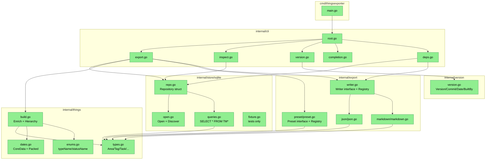

# thingsexporter MVP — Design

**Status:** Draft
**Author:** Mikhail Savin (через AI-ассистента в режиме spec-driven-dev)
**Date:** 2026-05-25
**Inputs:** `.spec/features/mvp/explore.md`, `.spec/features/mvp/requirements.md`

## 2.1 Overview

Greenfield-проект: CLI на Go, читающий SQLite-БД Things 3 в read-only и сериализующий её в JSON (default) или Markdown с выбираемым через `--include` пресетом состава. Архитектура раскладывается на пять слоёв:

1. **Entry & wiring** (`cmd/thingsexporter`) — единственный `main.go`, собирает зависимости и передаёт их в cobra.
2. **CLI surface** (`internal/cli`) — cobra-команды `export` (root), `inspect`, `version`, `completion`; явный test-seam `Deps` по образцу `todushka`.
3. **Domain** (`internal/things`) — типизированные модели сущностей (`Area`, `Tag`, `Task`, `ChecklistItem`, `Contact`, `Tombstone`, `Export`), конвертация `CoreDataTimestamp` и `PackedDate`, маппинг enum-кодов.
4. **Storage** (`internal/store/sqlite`) — открытие БД через `modernc.org/sqlite` в режиме `mode=ro`, чтение таблиц через `database/sql`, генерация fixture-БД для тестов, авто-определение `DefaultMacOSDBPath`.
5. **Export pipeline** (`internal/export`) — пресеты (`Preset.Apply(rawData)→Export`) и форматы (`Writer.Write(io.Writer, Export)`); регистрация форматов и пресетов через map-фабрики.

Плюс шестой «слой» — **инфраструктура**: `Taskfile.yml`, `.golangci.yml`, `.goreleaser.yaml`, два GitHub Actions workflow (`ci.yml`, `release.yml`), `dependabot.yml`, минимальный `README.md`, `LICENSE` (MIT), `.gitignore` с исключением реальной БД.

Все Open Design Questions из requirements.md закрыты явными ADR в §2.4.

## 2.2 Architecture

### Слои и зависимости



### Поток выполнения `thingsexporter export`

```mermaid
sequenceDiagram
    participant U as User
    participant CLI as cli.Execute
    participant Store as store/sqlite.Repository
    participant Build as things.Build
    participant Preset as export/preset.Preset
    participant Writer as export.Writer
    participant Out as stdout/file

    U->>CLI: thingsexporter export --include all --format json --db ?
    CLI->>CLI: parse flags
    CLI->>Store: Discover (if --db empty)
    CLI->>Store: Open(mode=ro)
    CLI->>Store: ReadAll() — RawData (rows from TM* tables)
    Store-->>CLI: RawData
    CLI->>Build: Build(RawData) — typed things.Export
    Build-->>CLI: things.Export (full)
    CLI->>Preset: Apply("all", Export) — same; for tasks/tasks+tags — trimmed view
    Preset-->>CLI: things.Export (filtered)
    CLI->>Writer: Write(out, Export) — json or markdown
    Writer->>Out: bytes
    CLI->>U: stderr: OK -> <path> + counts (unless --quiet)
```

### Implementation order (соответствует Topological Order из requirements §«Topological Order»)

1. `internal/version` (тривиально, нужно для linker-ldflags на сборке).
2. `internal/things` (types + dates + enums) — основа, без I/O.
3. `internal/store/sqlite` (open + queries + repo + fixture) — нужен для тестов на реальной схеме.
4. `internal/things/build.go` — обогащение + hierarchy (требует и things, и store-DTO).
5. `internal/export` (writer interface + preset + json + markdown).
6. `internal/cli` (root, deps, export, inspect, version, completion).
7. `cmd/thingsexporter/main.go` (склейка).
8. Инфраструктура: `Taskfile.yml`, `.golangci.yml`, `.goreleaser.yaml`, `.github/...`, `dependabot.yml`, `.gitignore`, `README.md`, `LICENSE`.
9. Тесты идут параллельно с каждым шагом 2–6 (red-first как требует фаза Implementation).

## 2.3 Components and Interfaces

### Files Requiring Changes

Все файлы — новые (репозиторий пустой).

| File | Change Type | Description |
|------|-------------|-------------|
| `go.mod` | `[NEW]` | `module github.com/jtprogru/thingsexporter`, `go 1.26.3`, зависимости: `github.com/spf13/cobra`, `modernc.org/sqlite`, `github.com/stretchr/testify`, `pgregory.net/rapid` |
| `go.sum` | `[NEW]` | Lockfile, генерируется `go mod tidy` |
| `cmd/thingsexporter/main.go` | `[NEW]` | Entry-point: создаёт `cli.Deps` (Stdout/Stderr/Stdin/Env/RepoFactory/WriterRegistry/PresetRegistry/Clock), вызывает `cli.Execute(deps)`, при панике пишет stack в stderr и выходит с кодом 2 |
| `internal/version/version.go` | `[NEW]` | `var Version, Commit, Date, BuiltBy string` (значения инжектятся ldflags) |
| `internal/things/types.go` | `[NEW]` | Структуры доменных сущностей с JSON-тегами (см. §2.5) |
| `internal/things/dates.go` | `[NEW]` | `CoreDataToISO(*float64) *string` и `PackedDateToISO(*int64) *string` с валидациями из REQ-2.1/2.3/2.4 |
| `internal/things/enums.go` | `[NEW]` | `TaskType(int) *string`, `TaskStatus(int) *string`, `ChecklistStatus(int) *string` — мапы из REQ-2.5/2.6 |
| `internal/things/build.go` | `[NEW]` | `Build(raw RawData, source string, exportedAt time.Time) Export` — обогащение задач/областей, сборка `Hierarchy`, подсчёт `Counts` |
| `internal/things/blob.go` | `[NEW]` | `EncodeBlob(b []byte, drop bool) *BlobValue` — реализация REQ-2.7/2.8 |
| `internal/store/sqlite/open.go` | `[NEW]` | `Open(path string) (*sql.DB, error)` — DSN `file:<path>?mode=ro`, `Discover() (string, bool)` — проверка `DefaultMacOSDBPath`, константа пути |
| `internal/store/sqlite/queries.go` | `[NEW]` | Текст SQL-запросов как `const` с двойными кавычками вокруг резервированных слов; функции `selectAreas/selectTags/selectTasks/.../selectTaskTags/selectAreaTags/selectMetaRows/selectCounts/selectDatabaseVersion` принимают `*sql.DB` и возвращают `[]things.<Type>` либо raw `[]byte` для BLOB-полей |
| `internal/store/sqlite/repo.go` | `[NEW]` | `Repository` struct с методом `ReadAll(ctx) (RawData, error)`, `ReadCounts(ctx) (Counts, error)`, `Close() error`. `RawData` — DTO с raw-полями (включая BLOB-байты, raw timestamps и raw enum-коды), который потом обогащает `things.Build` |
| `internal/store/sqlite/fixture.go` | `[NEW]` | `BuildFixture(t testing.TB) string` — создаёт временный SQLite, применяет DDL Things 3, вставляет контролируемый набор строк (≥2 areas, ≥2 tags, ≥5 tasks включая trashed, ≥1 checklist, ≥1 contact, ≥1 tombstone, ≥3 taskTag, ≥1 areaTag, Meta.databaseVersion=26). Файл с build-тегом `//go:build !release` или просто в _test.go-режиме |
| `internal/export/writer.go` | `[NEW]` | `type Writer interface { Format() string; Write(io.Writer, things.Export, Options) error }`; `Registry` с `Register/Lookup`; `Options struct { Indent int }` |
| `internal/export/preset/preset.go` | `[NEW]` | `type Preset interface { Name() string; Apply(things.Export) things.Export }`; `Registry` с `Register/Lookup`; четыре реализации: `presetAll/presetTasks/presetTasksTags/presetTasksProjects` |
| `internal/export/json/json.go` | `[NEW]` | `Writer` для JSON: использует `encoding/json` с `Encoder.SetIndent(" ", strings.Repeat(" ", indent))` при `indent>0`, иначе компактный `Encode` |
| `internal/export/markdown/markdown.go` | `[NEW]` | `Writer` для Markdown: рендерит `# Inbox` + `# Areas` секции по правилам REQ-4.3, `[ ]`/`[x]`/`[-]` для статусов, inline `#tag` и `⏰ YYYY-MM-DD`, notes как 4-пробельный блок, чек-листы как вложенный список `  - [ ]` (2 пробела indent) |
| `internal/cli/deps.go` | `[NEW]` | `type Deps struct { Stdout/Stderr io.Writer; Stdin io.Reader; Env func(string)string; Clock func() time.Time; OpenRepo func(path string) (*sqlite.Repository, error); DiscoverDB func() (string, bool); Writers *export.Registry; Presets *preset.Registry }`; `DefaultDeps()` |
| `internal/cli/root.go` | `[NEW]` | `NewRootCmd(Deps) *cobra.Command`; root настроен как `export` с дефолтами (RunE проксирует в `runExport`); регистрирует подкоманды |
| `internal/cli/export.go` | `[NEW]` | `newExportCmd(Deps)`; флаги `--db`, `--out`, `--format`, `--include`, `--indent`, `--no-blobs`, `--quiet`; `runExport(ctx, deps, opts) error` |
| `internal/cli/inspect.go` | `[NEW]` | `newInspectCmd(Deps)`; флаги `--db`, `--quiet`; читает только `selectCounts` + `selectDatabaseVersion`, печатает JSON в stdout |
| `internal/cli/version.go` | `[NEW]` | `newVersionCmd(Deps)`; печатает строку формата из REQ-6.6 (повторяет `todushka/internal/cli/version.go`) |
| `internal/cli/completion.go` | `[NEW]` | `newCompletionCmd(Deps)`; стандартный cobra-генератор |
| `internal/cli/errors.go` | `[NEW]` | `type ExitCodeError struct { Code int; Err error }`; `func asExit(err error) int` — маппит известные ошибки и валидации флагов в `2`, паники в `1`, success в `0` |
| `Taskfile.yml` | `[NEW]` | Таргеты: `test`, `test-race`, `build`, `cross-compile`, `lint`, `fmt`, `tidy`, `run` (повторяем `todushka/Taskfile.yml`, переменные `BIN_DIR=bin`, `CMD_PATH=./cmd/thingsexporter`) |
| `.golangci.yml` | `[NEW]` | v2-конфиг по образцу `todushka/.golangci.yml` (govet, staticcheck, errcheck, gosec, gocritic, revive, unused, ineffassign; gosec G104 в exclude; в тестах отключены gosec+errcheck) |
| `.goreleaser.yaml` | `[NEW]` | v2-конфиг по REQ-7.6/7.7: `CGO_ENABLED=0`, матрица `linux/darwin × amd64/arm64`, `-trimpath`, ldflags инжектят `internal/version` поля, `archives: tar.gz`, `checksum: sha256`, `sboms: syft`, `signs: cosign keyless`, `homebrew_formula` (не cask!) в `jtprogru/homebrew-tap` с описанием из REQ-7.7. Снапшот-шаблон `{{ incpatch .Version }}-next`, changelog с conventional commits |
| `.github/workflows/ci.yml` | `[NEW]` | По образцу `todushka/.github/workflows/ci.yml`: job `test` (go vet, govulncheck, go test -race -coverprofile), job `goreleaser-check` (goreleaser check + build --snapshot --clean --single-target). Все actions запиннены по SHA |
| `.github/workflows/release.yml` | `[NEW]` | По образцу `todushka/.github/workflows/release.yml`: trigger `push tags v*`, permissions `contents: write` + `id-token: write`, govulncheck → go test → install cosign + syft → `goreleaser release --clean` с `GITHUB_TOKEN` и `HOMEBREW_TAP_GITHUB_TOKEN` |
| `.github/dependabot.yml` | `[NEW]` | Weekly для `gomod` и `github-actions`, лимит 5 PR, префиксы `chore(deps)` / `chore(ci)` |
| `.gitignore` | `[NEW]` | `bin/`, `dist/`, `vendor/`, `*.test`, `*.out`, `cover.out`, `*.sqlite`, `*.sqlite-wal`, `*.sqlite-shm` (защита от случайного коммита пользовательской БД), `*.fail` (rapid seeds, если будут) |
| `LICENSE` | `[NEW]` | MIT-лицензия, copyright `Mikhail Savin <jtprogru@gmail.com>` |
| `README.md` | `[NEW]` | Install (brew/go install), usage (примеры команд: дефолтный экспорт, markdown, пресеты, inspect, version), список флагов, упоминание Things 3 и поддерживаемой `databaseVersion=26`, лицензия |
| `pipeline.sh` | `[NEW]` (уже создан) | Вспомогательный shim для spec-driven-dev pipeline; **в публичную сборку не входит** (лежит в корне), добавим в `.gitignore`? — нет, нужно решение: оставить в репо как dev-utility или вынести вне репо. **Решение в ADR-7**: исключим из git через `.gitignore`. |

### Files NOT Requiring Changes

| File | Reason Unchanged |
|------|-----------------|
| `/Users/jtprogru/Work/tmp/things3db/*` | Внешний референс, не часть нашего репозитория — никакие изменения там не предусмотрены |
| `/Users/jtprogru/Work/github/jtprogru/todushka/*` | Соседний проект-донор инфраструктуры, забираем шаблоны без изменений в самом todushka |
| `/Users/jtprogru/Work/github/jtprogru/homebrew-tap/*` | GoReleaser автоматически коммитит туда обновления formula при релизе через `HOMEBREW_TAP_GITHUB_TOKEN`; ручных правок не делаем |
| `.spec/features/mvp/explore.md` | Артефакт фазы 1, неизменяемый input |
| `.spec/features/mvp/requirements.md` | Артефакт фазы 2, неизменяемый input |
| `.serena/`, `.claude/` | Локальные IDE/агент-конфиги, не относящиеся к коду продукта |
| `Makefile` | Намеренно не используем — все команды через Taskfile (как в todushka). Дублирование вредно для maintenance |
| Тестовая `main.sqlite` пользователя | Никогда не коммитится; используется только при ручном smoke-тесте |

### Interface signatures (только сигнатуры, без тел)

```go
// internal/version
package version
var (
    Version = "dev"
    Commit  = ""
    Date    = ""
    BuiltBy = ""
)

// internal/things/dates.go
package things
func CoreDataToISO(v *float64) *string             // REQ-2.1, 2.2
func PackedDateToISO(v *int64) *string             // REQ-2.3, 2.4

// internal/things/enums.go
func TaskTypeName(code *int64) *string             // REQ-2.5
func TaskStatusName(code *int64) *string           // REQ-2.5
func ChecklistStatusName(code *int64) *string      // REQ-2.6

// internal/things/blob.go
type BlobValue struct {
    Hex *string `json:"__blob_hex__,omitempty"`
}
func EncodeBlob(b []byte, drop bool) *BlobValue    // REQ-2.7, 2.8 (nil — становится `null` в JSON)

// internal/things/build.go
type RawData struct { /* see §2.5 */ }
type BuildOptions struct {
    Source     string
    ExportedAt time.Time
    NoBlobs    bool
}
func Build(raw RawData, opts BuildOptions) Export   // REQ-3.x, 2.x

// internal/store/sqlite/open.go
const DefaultMacOSDBPath = "Library/Group Containers/JLMPQHK86H.com.culturedcode.ThingsMac/Things Database.thingsdatabase/main.sqlite"
func Discover(home string, goos string, statFn func(string) error) (string, bool)  // REQ-1.2, 1.3
func Open(path string) (*sql.DB, error)                                            // REQ-1.1, 1.4

// internal/store/sqlite/repo.go
type Repository struct { /* *sql.DB */ }
func NewRepository(db *sql.DB) *Repository
func (*Repository) ReadAll(ctx context.Context) (things.RawData, error)   // REQ-1.5
func (*Repository) ReadCounts(ctx context.Context) (things.Counts, error)
func (*Repository) DatabaseVersion(ctx context.Context) (*int, error)     // для REQ-1.6, REQ-6.5
func (*Repository) Close() error

// internal/store/sqlite/fixture.go (только при сборке тестов)
func BuildFixture(t testing.TB) string  // returns path to temp SQLite

// internal/export/writer.go
package export
type Options struct { Indent int }
type Writer interface {
    Format() string                                                 // "json" | "markdown"
    Write(out io.Writer, data things.Export, opts Options) error
}
type Registry struct { /* ... */ }
func NewRegistry(writers ...Writer) *Registry
func (*Registry) Register(w Writer)
func (*Registry) Lookup(format string) (Writer, error)              // REQ-4.5
func (*Registry) Formats() []string

// internal/export/preset/preset.go
type Preset interface {
    Name() string                                                   // "all" | "tasks" | "tasks+tags" | "tasks+projects"
    Apply(in things.Export) things.Export                           // REQ-5.x
}
type Registry struct { /* ... */ }
func NewRegistry(presets ...Preset) *Registry
func (*Registry) Register(p Preset)
func (*Registry) Lookup(name string) (Preset, error)                // REQ-5.5
func (*Registry) Names() []string

// internal/cli/deps.go
type Deps struct {
    Stdout, Stderr io.Writer
    Stdin          io.Reader
    Env            func(string) string
    Clock          func() time.Time
    OpenRepo       func(path string) (*sqlite.Repository, error)
    DiscoverDB     func() (string, bool)
    Writers        *export.Registry
    Presets        *preset.Registry
}
func DefaultDeps() Deps

// internal/cli/root.go
func NewRootCmd(deps Deps) *cobra.Command
func Execute(deps Deps) error

// internal/cli/errors.go
type ExitCodeError struct {
    Code int
    Err  error
}
func (*ExitCodeError) Error() string
func (*ExitCodeError) Unwrap() error
func AsExitCode(err error) int  // 0 / 2 / 1 per REQ-6.9
```

## 2.4 Key Decisions (ADR)

### ADR-1: Pure-Go SQLite — `modernc.org/sqlite`

- **Context.** REQ-7.1 требует `CGO_ENABLED=0`; матрица сборок `linux/darwin × amd64/arm64`.
- **Options considered.** (a) `modernc.org/sqlite` — pure Go; (b) `mattn/go-sqlite3` — CGO над system SQLite; (c) `ncruces/go-sqlite3` — WASM-runtime.
- **Decision.** `modernc.org/sqlite` через `database/sql`, DSN `file:<path>?mode=ro`.
- **Rationale.** Единственный вариант, совместимый с CGO-free сборкой goreleaser-матрицы без cross-toolchain. Зрелый, в больших проектах. Лишний бинарь-размер (~12 МБ) приемлем для CLI. WASM-вариант экзотичен, выигрыша нет.
- **Consequences.** Один static-binary, легко устанавливается через brew без зависимостей. Чуть медленнее `mattn` на больших нагрузках — несущественно для 600-строчной БД.

### ADR-2: Доменные структуры — указатели для nullable полей

- **Context.** Open Design Question #1: как моделировать nullable-поля. Колонки `TMTask.area/project/heading/contact`, все timestamp-поля, многие `--indent`-числовые могут быть `NULL`.
- **Options considered.** (a) Pointer-fields (`*string`, `*int64`, `*float64`); (b) `sql.NullString`/`sql.NullInt64` (с custom MarshalJSON); (c) zero-value semantics (пустая строка = null) с пометкой `omitempty`.
- **Decision.** Pointer-fields для всех полей, которые в Python-выгрузке могут быть `null`. Для read-row из БД — `sql.NullString`/`sql.NullFloat64`/`sql.NullInt64` как сема ввода, затем конвертация в `*T` при построении доменной модели.
- **Rationale.** Точная семантика null vs 0 vs ""; идиоматичный Go JSON-вывод (nil pointer → `null`); `sql.Null*` нельзя напрямую отдать в `encoding/json` без custom Marshal. Двух-этапная конвертация делает границу storage/domain явной.
- **Consequences.** Чуть многословнее код struct-определений. Тесты должны проверять различение `nil` от `*Type(0)`.

### ADR-3: meta.counts строится по факту коллекций ПОСЛЕ применения пресета

- **Context.** Open Design Question #2: как заполнять `meta.counts` для частичных пресетов (`tasks`, `tasks+tags`, `tasks+projects`).
- **Options considered.** (a) Всегда считать все 8 счётчиков (как в Python), но при пресете оставлять только релевантные ключи; (b) Считать только те коллекции, которые реально включены в Export — остальные ключи отсутствуют; (c) Всегда отдавать полный набор счётчиков независимо от пресета.
- **Decision.** Вариант (b): `Counts` — это `map[string]int` (или `struct` с указателями); ключи `areas/tags/tasks/checklistItems/contacts/tombstones/taskTagLinks/areaTagLinks` присутствуют только если соответствующая коллекция выгружена. Для пресета `all` — все 8 ключей.
- **Rationale.** «Counts of what is in this file» — самая интуитивная модель. Несоответствие counts vs реально присутствующих коллекций путало бы пользователя и тесты. REQ-3.6 явно говорит «отражает фактические длины ПОСЛЕ применения пресета».
- **Consequences.** При расширении пресетов в v2 (например, `structure`) автоматически появляются новые ключи без изменения формы. Сравнение с Python-выгрузкой (которая всегда даёт все 8) — не bit-to-bit, но это уже зафиксировано в Constraints.

### ADR-4: `database/sql` напрямую, без обёртки

- **Context.** Open Design Question #3.
- **Options considered.** (a) `database/sql` напрямую; (b) `jmoiron/sqlx` для авто-маппинга строк в struct; (c) кастомный wrapper.
- **Decision.** `database/sql` напрямую.
- **Rationale.** У нас только 9 SELECT-ов фиксированной формы. `sqlx` экономит ~30 строк кода ценой ещё одной зависимости. Кастомный wrapper не оправдан масштабом.
- **Consequences.** Чуть длиннее код `queries.go` (явные `rows.Scan` для каждой таблицы). Полный контроль над nullable-полями и BLOB-байтами.

### ADR-5: JSON — `encoding/json` из stdlib, БЕЗ ASCII-escape

- **Context.** Open Design Question #4. REQ-4.1 требует поддержку кириллицы и эмодзи.
- **Options considered.** (a) `encoding/json` с `Encoder.SetEscapeHTML(false)`; (b) `encoding/json/v2` (если стабилен в go 1.26); (c) сторонний `json-iterator`.
- **Decision.** `encoding/json` + `Encoder.SetEscapeHTML(false)` + `Encoder.SetIndent("", "  ")` (или другая ширина).
- **Rationale.** Стабильность важнее экспериментального API. v2 ещё не GA. Сторонняя зависимость не оправдана.
- **Consequences.** Порядок ключей в map[string]interface{} — алфавитный (особенность encoding/json). Поэтому ключи Export всё ещё через структуры, а не через `map[string]interface{}`, — структуры дают порядок объявления полей. `db_meta_rows` и тому подобные перечисления — `[]MetaRow{Key, Value}`, не map.

### ADR-6: Подпакеты для форматов и пресетов

- **Context.** Open Design Question #5.
- **Options considered.** (a) Один пакет `internal/export` с типом и реализациями вместе; (b) Корневой `internal/export` с интерфейсами + подпакеты `internal/export/json`, `internal/export/markdown`, `internal/export/preset`; (c) Параллельные пакеты `internal/format` + `internal/preset`.
- **Decision.** Вариант (b).
- **Rationale.** Интерфейс и реестр (`Writer`, `Registry`, `Options`) — в одном корневом пакете `export`. Реализации — в подпакетах, чтобы их можно было импортировать выборочно (например, в тесте Markdown не тянуть JSON-зависимости). Пресеты — отдельный пакет `internal/export/preset`, чтобы не плодить циклы: они работают над типами `things`, как и форматы, но логически — другая роль (фильтрация vs сериализация).
- **Consequences.** Чуть больше файлов, но границы пакетов очевидны. `DefaultDeps()` импортирует все три, регистрирует в Registry, передаёт в cli.

### ADR-7: Шим `pipeline.sh` для spec-driven-dev — исключаем из git

- **Context.** При инициализации фазы Explore был скопирован `pipeline.sh` из `~/.claude/skills/spec-driven-dev/scripts/`. Это dev-utility текущего workflow, не часть продукта.
- **Options considered.** (a) Коммитить как dev-tool; (b) Исключить через `.gitignore`; (c) Симлинк наружу.
- **Decision.** Исключить через `.gitignore` (добавим `/pipeline.sh` и `.spec/.pipeline-state*`-файлы, если они появятся; артефакты фаз `explore.md`/`requirements.md`/`design.md` остаются).
- **Rationale.** Скрипт — версионируется в общем skill-репозитории Claude; в репо `thingsexporter` он временный для текущего цикла разработки. Артефакты — да, нужны (они документация); скрипт — нет.
- **Consequences.** Любой, кто захочет продолжить пайплайн в этом репо, должен скопировать `pipeline.sh` себе так же, как это сделали мы. Это явное требование skill'а — приемлемо.

### ADR-8: Markdown чек-листы — 2-пробельный вложенный список

- **Context.** Open Design Question #6.
- **Options considered.** (a) Чек-лист в одной плоскости с задачами (просто следом); (b) Вложенный список с 2 пробелами (`  - [ ]`); (c) 4 пробела indent (одинаково с notes).
- **Decision.** (b) — `  - [ ]` (2 пробела + дефис).
- **Rationale.** GFM nesting list = 2 пробела. Visually разделяет notes (4 пробела indent, без bullet) и чек-лист (2 пробела indent, с bullet). Obsidian Tasks плагин рендерит такое вложение корректно.
- **Consequences.** Тест Markdown должен валидировать ровно 2 пробела. Если пользователь использует строгий Markdown-линтер с фиксированным indent — настройка через флаг в v2.

### ADR-9: Versioning & Backward Compatibility

- **Context.** Утилита публикует **формат вывода** (JSON и Markdown), который пользователи могут парсить downstream. Это публичный контракт.
- **Versioning strategy.** SemVer на самом инструменте (`v0.x.y` пока MVP не стабилизирован; `v1.0.0` — фиксация JSON-схемы и Markdown-структуры как стабильных). Внутри `meta` Export добавим поле `schema: "thingsexporter/v1"` (плюс уже есть `db_meta_rows` с `databaseVersion`). Любое **удаление или переименование** полей в Export — major bump; **добавление** новых необязательных полей — minor.
- **Breaking change assessment.** На MVP-этапе (`v0.x`) breaking changes допустимы без warning, но фиксируются в CHANGELOG (auto-generated GoReleaser-ом). Пользователи `v0.x` предупреждаются в README, что схема не стабильна до `v1.0`.
- **Migration path.** Когда тегается `v1.0`, добавляем `meta.schema = "thingsexporter/v1"` и публикуем JSON-Schema-файл в репо (`schemas/v1.json`) как опциональный артефакт. Дальнейшие major-релизы хранят прошлые схемы.
- **Consequences.** Пользователи могут безопасно скриптовать с `v0.x`, если зафиксируют конкретную версию (`brew pin`, `go install ...@v0.2.1`). Поле `schema` в meta появляется уже в MVP — нулевой стоимости, страхует на будущее.

## 2.5 Data Models

Все типы — `[NEW]`. Показаны Go-определения, тегами обозначены имена полей в JSON-выводе.

```go
// internal/things/types.go

// [NEW] Корневая структура экспорта.
// Поля, не релевантные текущему пресету, опускаются через omitempty.
type Export struct {
    Schema         string             `json:"schema"`             // ADR-9: "thingsexporter/v1"
    Meta           Meta               `json:"meta"`               // REQ-3.6
    Areas          []Area             `json:"areas,omitempty"`    // REQ-5.x
    Tags           []Tag              `json:"tags,omitempty"`     // REQ-5.x
    Tasks          []Task             `json:"tasks,omitempty"`    // REQ-5.x
    ChecklistItems []ChecklistItem    `json:"checklistItems,omitempty"`
    Contacts       []Contact          `json:"contacts,omitempty"`
    Tombstones     []Tombstone        `json:"tombstones,omitempty"`
    Links          *Links             `json:"links,omitempty"`    // только для пресета all
    Hierarchy      *Hierarchy         `json:"hierarchy,omitempty"`// только для пресета all
}

// [NEW]
type Meta struct {
    Source      string       `json:"source"`         // путь к main.sqlite
    ExportedAt  string       `json:"exportedAt"`     // ISO 8601 UTC (clock.Now())
    Counts      Counts       `json:"counts"`         // ADR-3: только включённые ключи
    DBMetaRows  []MetaRow    `json:"db_meta_rows"`   // table Meta as-is
}

// [NEW] Поля-указатели — отсутствуют, если пресет не включает коллекцию.
// Маршалится как объект — порядок ключей детерминирован структурой.
type Counts struct {
    Areas          *int `json:"areas,omitempty"`
    Tags           *int `json:"tags,omitempty"`
    Tasks          *int `json:"tasks,omitempty"`
    ChecklistItems *int `json:"checklistItems,omitempty"`
    Contacts       *int `json:"contacts,omitempty"`
    Tombstones     *int `json:"tombstones,omitempty"`
    TaskTagLinks   *int `json:"taskTagLinks,omitempty"`
    AreaTagLinks   *int `json:"areaTagLinks,omitempty"`
}

// [NEW]
type MetaRow struct {
    Key   string `json:"key"`
    Value string `json:"value"`
}

// [NEW] Доменная модель Области (TMArea).
type Area struct {
    UUID         string      `json:"uuid"`
    Title        *string     `json:"title"`
    Visible      *int64      `json:"visible"`
    Index        *int64      `json:"index"`
    CachedTags   *BlobValue  `json:"cachedTags"`     // BLOB → hex или null
    Experimental *BlobValue  `json:"experimental"`
    Tags         []TagRef    `json:"tags"`           // REQ-3.4
}

// [NEW] Доменная модель Тега (TMTag).
type Tag struct {
    UUID         string     `json:"uuid"`
    Title        *string    `json:"title"`
    Shortcut     *string    `json:"shortcut"`
    UsedDate     *string    `json:"usedDate"`       // CoreData → ISO
    Parent       *string    `json:"parent"`         // uuid родителя
    Index        *int64     `json:"index"`
    Experimental *BlobValue `json:"experimental"`
    ParentTitle  *string    `json:"parentTitle"`    // обогащается из parent
}

// [NEW] Доменная модель Задачи (TMTask).
// 39 колонок исходной таблицы + 9 обогащённых полей.
type Task struct {
    // Идентификация и tombstone
    UUID            string `json:"uuid"`
    LeavesTombstone *int64 `json:"leavesTombstone"`

    // Даты (CoreData → ISO)
    CreationDate                 *string `json:"creationDate"`
    UserModificationDate         *string `json:"userModificationDate"`
    StopDate                     *string `json:"stopDate"`
    LastReminderInteractionDate  *string `json:"lastReminderInteractionDate"`
    RepeaterMigrationDate        *string `json:"repeaterMigrationDate"`

    // Состояние
    Type     *int64  `json:"type"`
    Status   *int64  `json:"status"`
    Trashed  *int64  `json:"trashed"`
    Title    *string `json:"title"`
    Notes    *string `json:"notes"`
    NotesSync *int64 `json:"notesSync"`

    // Cache + flags
    CachedTags    *BlobValue `json:"cachedTags"`
    Start         *int64     `json:"start"`
    StartBucket   *int64     `json:"startBucket"`
    ReminderTime  *int64     `json:"reminderTime"`

    // Даты-packed (raw int + ISO-производное)
    StartDate                     *int64  `json:"startDate"`
    StartDateISO                  *string `json:"startDateISO"`
    Deadline                      *int64  `json:"deadline"`
    DeadlineISO                   *string `json:"deadlineISO"`
    DeadlineSuppressionDate       *int64  `json:"deadlineSuppressionDate"`
    DeadlineSuppressionDateISO    *string `json:"deadlineSuppressionDateISO"`
    T2DeadlineOffset              *int64  `json:"t2_deadlineOffset"`

    // Сортировка
    Index                    *int64  `json:"index"`
    TodayIndex               *int64  `json:"todayIndex"`
    TodayIndexReferenceDate  *int64  `json:"todayIndexReferenceDate"`

    // Ссылки
    Area    *string `json:"area"`
    Project *string `json:"project"`
    Heading *string `json:"heading"`
    Contact *string `json:"contact"`

    // Counts
    UntrashedLeafActionsCount     *int64 `json:"untrashedLeafActionsCount"`
    OpenUntrashedLeafActionsCount *int64 `json:"openUntrashedLeafActionsCount"`
    ChecklistItemsCount           *int64 `json:"checklistItemsCount"`
    OpenChecklistItemsCount       *int64 `json:"openChecklistItemsCount"`

    // Repeating template (rt1_*)
    Rt1RepeatingTemplate            *string    `json:"rt1_repeatingTemplate"`
    Rt1RecurrenceRule               *BlobValue `json:"rt1_recurrenceRule"`
    Rt1InstanceCreationStartDate    *int64     `json:"rt1_instanceCreationStartDate"`
    Rt1InstanceCreationPaused       *int64     `json:"rt1_instanceCreationPaused"`
    Rt1InstanceCreationCount        *int64     `json:"rt1_instanceCreationCount"`
    Rt1AfterCompletionReferenceDate *int64     `json:"rt1_afterCompletionReferenceDate"`
    Rt1NextInstanceStartDate        *int64     `json:"rt1_nextInstanceStartDate"`

    // Прочее
    Experimental *BlobValue `json:"experimental"`
    Repeater     *BlobValue `json:"repeater"`

    // Обогащённые поля (Python parity)
    TypeName     *string         `json:"typeName"`
    StatusName   *string         `json:"statusName"`
    AreaTitle    *string         `json:"areaTitle,omitempty"`     // только при пресете all/tasks+projects
    ProjectTitle *string         `json:"projectTitle,omitempty"`  // -//-
    HeadingTitle *string         `json:"headingTitle,omitempty"`  // -//-
    ContactName  *string         `json:"contactName,omitempty"`   // -//-
    Tags         []TagRef        `json:"tags,omitempty"`          // только all/tasks+tags
    Checklist    []ChecklistItem `json:"checklist,omitempty"`     // только all
}

// [NEW]
type ChecklistItem struct {
    UUID                 string     `json:"uuid"`
    UserModificationDate *string    `json:"userModificationDate"`
    CreationDate         *string    `json:"creationDate"`
    Title                *string    `json:"title"`
    Status               *int64     `json:"status"`
    StopDate             *string    `json:"stopDate"`
    Index                *int64     `json:"index"`
    Task                 *string    `json:"task"`
    LeavesTombstone      *int64     `json:"leavesTombstone"`
    Experimental         *BlobValue `json:"experimental"`
    StatusName           *string    `json:"statusName"`
}

// [NEW]
type Contact struct {
    UUID                 string  `json:"uuid"`
    DisplayName          *string `json:"displayName"`
    FirstName            *string `json:"firstName"`
    LastName             *string `json:"lastName"`
    Emails               *string `json:"emails"`
    AppleAddressBookID   *string `json:"appleAddressBookId"`
    Index                *int64  `json:"index"`
}

// [NEW]
type Tombstone struct {
    UUID              string  `json:"uuid"`
    DeletionDate      *string `json:"deletionDate"`
    DeletedObjectUUID *string `json:"deletedObjectUUID"`
}

// [NEW]
type TagRef struct {
    UUID  string  `json:"uuid"`
    Title *string `json:"title"`
}

// [NEW]
type Links struct {
    TaskTag []TaskTagLink `json:"taskTag"`
    AreaTag []AreaTagLink `json:"areaTag"`
}
type TaskTagLink struct {
    Task string `json:"task"`
    Tag  string `json:"tag"`
}
type AreaTagLink struct {
    Area string `json:"area"`
    Tag  string `json:"tag"`
}

// [NEW]
type Hierarchy struct {
    Areas             []HierarchyArea `json:"areas"`
    InboxOrOrphanTasks []HierarchyItem `json:"inbox_or_orphan_tasks"`
}
type HierarchyArea struct {
    UUID    string          `json:"uuid"`
    Title   *string         `json:"title"`
    Visible *int64          `json:"visible"`
    Index   *int64          `json:"index"`
    Tags    []TagRef        `json:"tags"`
    Items   []HierarchyItem `json:"items"`
}
type HierarchyItem struct {
    UUID       string  `json:"uuid"`
    Title      *string `json:"title"`
    TypeName   *string `json:"typeName"`
    StatusName *string `json:"statusName"`
}

// [NEW] Промежуточный тип на границе storage/domain.
// Содержит «сырые» данные ровно так, как они пришли из SELECT,
// до конвертации дат и enum. things.Build потребляет RawData и выдаёт Export.
type RawData struct {
    Areas         []rawArea
    Tags          []rawTag
    Tasks         []rawTask
    Checklist     []rawChecklist
    Contacts      []rawContact
    Tombstones    []rawTombstone
    TaskTagPairs  []TaskTagLink
    AreaTagPairs  []AreaTagLink
    MetaRows      []MetaRow
}
// (приватные raw*-типы хранят: timestamps как *float64, packed dates как *int64,
//  enum-коды как *int64, BLOB-поля как []byte; ровно такие они приходят из database/sql)
```

## 2.6 Correctness Properties

### Property 1: read-only invariant
- **Category:** Absence
- **Statement:** For all успешных вызовов `Repository.ReadAll`, `Repository.ReadCounts`, `Repository.DatabaseVersion` на любой существующей валидной БД, mtime файла `main.sqlite` и его WAL/SHM-журналов до и после вызова идентичны (с точностью до файловой системы).
- **Validates:** REQ-1.1

### Property 2: CoreData round-trip
- **Category:** Round-trip
- **Statement:** For all `t` ∈ диапазон валидных Things-timestamps (Unix epoch [2001-01-01, 2100-01-01]), пара (`secondsFromEpoch=t-CoreDataEpoch`, `CoreDataToISO(&secondsFromEpoch)`) такова, что `time.Parse(time.RFC3339Nano, *result).Unix() == t.Unix()` и таймзона результата — `UTC`.
- **Validates:** REQ-2.1, REQ-2.2

### Property 3: PackedDate decode
- **Category:** Equivalence
- **Statement:** For all `(year, month, day)` ∈ [1970..2100] × [1..12] × [1..31], `PackedDateToISO(pack(year,month,day))` строго равен `fmt.Sprintf("%04d-%02d-%02d", year, month, day)`.
- **Validates:** REQ-2.3

### Property 4: PackedDate rejects invalid
- **Category:** Absence
- **Statement:** For all `n` ∈ int64, у которых декодированные `year/month/day` НЕ удовлетворяют условиям из REQ-2.4 (а также для `n=0` и `nil`), `PackedDateToISO` возвращает `nil`.
- **Validates:** REQ-2.4

### Property 5: enum mapping totality
- **Category:** Equivalence
- **Statement:** For all `code` ∈ известный диапазон ({0,1,2} для TaskType, {0,2,3} для TaskStatus, {0,3} для ChecklistStatus), `*Name(&code)` равен ожидаемой строке; for all `code` вне диапазона, результат — `nil`.
- **Validates:** REQ-2.5, REQ-2.6

### Property 6: BLOB encoding
- **Category:** Equivalence
- **Statement:** For all `b []byte` и `drop bool`: если `drop==true` — `EncodeBlob(b, true) == nil`; иначе если `len(b)==0` — `EncodeBlob(b, false) == nil`; иначе — `EncodeBlob(b, false).Hex != nil && *.Hex == hex.EncodeToString(b)` (lowercase).
- **Validates:** REQ-2.7, REQ-2.8

### Property 7: counts match collections
- **Category:** Equivalence
- **Statement:** For all `Export e` (после `Build` и `Preset.Apply`), для каждой коллекции `C` ∈ {Areas, Tags, Tasks, ChecklistItems, Contacts, Tombstones}: `(e.Meta.Counts.<C> != nil) ⇔ (e.<C> != nil)`; и если оба не nil — `*e.Meta.Counts.<C> == len(e.<C>)`. Аналогично для `TaskTagLinks` ↔ `len(e.Links.TaskTag)` (если `Links` присутствует).
- **Validates:** REQ-3.6

### Property 8: tags enrichment for tasks
- **Category:** Propagation
- **Statement:** For all `Export e` с пресетом, включающим теги (`all` или `tasks+tags`), и для каждой задачи `t ∈ e.Tasks`: `len(t.Tags) == |{(taskUUID,tagUUID) ∈ raw.TaskTagPairs : taskUUID == t.UUID}|`, и для каждого `tag ∈ t.Tags` существует тег с тем же UUID в коллекции `e.Tags` (или, для пресета `tasks+tags`, в исходных `raw.Tags`).
- **Validates:** REQ-3.1, REQ-3.2, REQ-5.1, REQ-5.3

### Property 9: hierarchy excludes trashed
- **Category:** Absence
- **Statement:** For all `Export e` с пресетом `all`, никакой UUID, у которого `Trashed != nil && *Trashed == 1` в исходной коллекции `e.Tasks`, не появляется в `e.Hierarchy.Areas[*].Items[*].UUID` или `e.Hierarchy.InboxOrOrphanTasks[*].UUID`.
- **Validates:** REQ-3.5

### Property 10: hierarchy ordering
- **Category:** Equivalence
- **Statement:** For all `Export e` с пресетом `all`: `e.Hierarchy.Areas` отсортирован по `Index` ASC (`nil` в конце); for all area `a ∈ e.Hierarchy.Areas`, `a.Items` отсортирован по `Index` ASC (`nil` в конце). Тоже для `Hierarchy.InboxOrOrphanTasks`.
- **Validates:** REQ-3.5

### Property 11: preset content scope
- **Category:** Exclusion
- **Statement:** For all `Export e`, полученного через `presetTasks.Apply`: `e.Areas == nil && e.Tags == nil && e.ChecklistItems == nil && e.Contacts == nil && e.Tombstones == nil && e.Links == nil && e.Hierarchy == nil`, и для каждой задачи `t ∈ e.Tasks`: `t.Tags == nil && t.Checklist == nil && t.AreaTitle == nil && t.ProjectTitle == nil && t.HeadingTitle == nil && t.ContactName == nil`. Аналогичные exclusion-инварианты для пресетов `tasks+tags` и `tasks+projects` (по правилам REQ-5.3, REQ-5.4).
- **Validates:** REQ-5.2, REQ-5.3, REQ-5.4

### Property 12: format dispatch
- **Category:** Equivalence
- **Statement:** For all `format ∈ {"json", "markdown"}`, `Registry.Lookup(format)` возвращает Writer, `Writer.Format() == format`, и `Writer.Write(io.Discard, validExport, opts)` завершается без ошибки. For all `format ∉ {"json", "markdown"}`, `Lookup` возвращает ошибку с сообщением, содержащим `unknown format` и `<format>`.
- **Validates:** REQ-4.5, REQ-5.5 (аналогичная пара для presets)

### Property 13: JSON indent
- **Category:** Equivalence
- **Statement:** For all `Export e` и `n ∈ {0, 1, 2, 4, 8}`: при `n==0` сериализованный байт-поток `jsonWriter.Write(..., Options{Indent:0})` не содержит символа `\n` и многоразовых пробелов между токенами; при `n>0` каждая открывающая скобка `{` или `[` непустого контейнера сопровождается переводом строки и indent-уровнем = глубина × n пробелов.
- **Validates:** REQ-4.1, REQ-4.2

### Property 14: Markdown checkbox markers
- **Category:** Propagation
- **Statement:** For all задачи `t` в выводе Markdown: ровно один из маркеров `[ ]`, `[x]`, `[-]` появляется в строке задачи, соответствующий `t.StatusName` (`open`/`completed`/`canceled` соответственно). Для `t.StatusName == nil` маркер — `[ ]` (open по умолчанию).
- **Validates:** REQ-4.3

### Property 15: macOS discover propagation
- **Category:** Propagation
- **Statement:** For all `(home string, goos string)`: `Discover(home, "darwin", statOK)` возвращает `(home + "/" + DefaultMacOSDBPath, true)`; `Discover(home, "darwin", statErr)` и `Discover(home, "linux", _)` и `Discover("", *, _)` возвращают `("", false)`.
- **Validates:** REQ-1.2, REQ-1.3

### Property 16: exit codes
- **Category:** Equivalence
- **Statement:** For all `err`: `AsExitCode(nil) == 0`; `AsExitCode(*ExitCodeError{Code:2,...}) == 2`; `AsExitCode(errors.New("io fail")) == 2` (любая I/O или validation = 2); `AsExitCode(panicValue) == 1` (через recover в main).
- **Validates:** REQ-6.9

### Property 17: SQL reserved-word quoting
- **Category:** Absence
- **Statement:** For all SQL-запросов в `internal/store/sqlite/queries.go`, упоминающих идентификаторы из множества `{index, type, status, start}`, каждое такое упоминание окружено двойными кавычками. Эквивалентно: regex `[^"]\b(index|type|status|start)\b[^"]` не находит совпадений в склейке всех `const`-запросов файла.
- **Validates:** REQ-1.5

### Property 18: --no-blobs propagation
- **Category:** Propagation
- **Statement:** For all `Export e`, построенного с `BuildOptions{NoBlobs: true}`: в каждом BLOB-поле (`*BlobValue`) задачи, области, чек-листа, тега значение строго `nil`; в сериализованном JSON эти ключи присутствуют со значением `null`.
- **Validates:** REQ-2.8

### Property 19: --quiet suppresses report
- **Category:** Exclusion
- **Statement:** For all `runExport` с флагом `--quiet`: ровно одна запись в `stderr` (или ноль) в случае успеха — авто-detect path-сообщение (только если оно сейчас бы напечаталось). Никакой `OK -> ...\n  counts:...` отчёт НЕ появляется в `stderr`. Для `runExport` без `--quiet` — отчёт обязательно появляется.
- **Validates:** REQ-6.4, REQ-1.2

### Property 20: schema field present
- **Category:** Equivalence
- **Statement:** For all `Export e`: `e.Schema == "thingsexporter/v1"`. Сериализованный JSON для любого пресета содержит ключ `"schema"` на верхнем уровне.
- **Validates:** ADR-9 (страховка совместимости)

### Traceability Matrix

| Requirement | Correctness Properties |
|-------------|------------------------|
| REQ-1.1 | CP-1 |
| REQ-1.2 | CP-15, CP-19 |
| REQ-1.3 | CP-15 |
| REQ-1.4 | Error Handling §2.7 (table) + integration test |
| REQ-1.5 | CP-17 + integration test |
| REQ-1.6 | Error Handling §2.7 + unit test для `DatabaseVersion` warning |
| REQ-2.1 | CP-2 |
| REQ-2.2 | CP-2 |
| REQ-2.3 | CP-3 |
| REQ-2.4 | CP-4 |
| REQ-2.5 | CP-5 |
| REQ-2.6 | CP-5 |
| REQ-2.7 | CP-6 |
| REQ-2.8 | CP-6, CP-18 |
| REQ-3.1 | CP-8 + integration test |
| REQ-3.2 | CP-8 |
| REQ-3.3 | Integration test (preset all) |
| REQ-3.4 | Integration test (preset all) |
| REQ-3.5 | CP-9, CP-10 |
| REQ-3.6 | CP-7 |
| REQ-4.1 | CP-13 |
| REQ-4.2 | CP-13 |
| REQ-4.3 | CP-14 + integration test |
| REQ-4.4 | Integration test (markdown без тегов в пресете) |
| REQ-4.5 | CP-12 |
| REQ-5.1 | CP-8, CP-11 (по комплементу) |
| REQ-5.2 | CP-11 |
| REQ-5.3 | CP-11, CP-8 |
| REQ-5.4 | CP-11 |
| REQ-5.5 | CP-12 (аналог для presets) |
| REQ-6.1 | Integration test (root без аргументов = export defaults) |
| REQ-6.2 | Integration test (флаги парсятся) |
| REQ-6.3 | Integration test (stdout vs file) |
| REQ-6.4 | CP-19 + integration test |
| REQ-6.5 | Integration test (inspect печатает JSON) |
| REQ-6.6 | Unit test (version output format) |
| REQ-6.7 | Smoke test (completion bash/zsh/fish/powershell) |
| REQ-6.8 | Smoke test (--help) |
| REQ-6.9 | CP-16 |
| REQ-7.1..7.10 | Goreleaser-check job + manual smoke release (см. §2.8 Project Commands) |
| REQ-8.1..8.5 | Метатребования — выполняются самим §2.8 |
| ADR-9 schema | CP-20 |

## 2.7 Error Handling

| Scenario | Detection | Action |
|----------|-----------|--------|
| `--db` не задан, ОС не macOS | `Discover()` возвращает `("", false)`; goos определяется через `runtime.GOOS` | Exit 2, stderr: `error: --db is required (no Things 3 database found at default path)`. REQ-1.3 |
| `--db` не задан, ОС macOS, файл не найден | `Discover()` возвращает `("", false)` после `os.Stat` | То же что выше (одинаковое сообщение). REQ-1.3 |
| `--db <path>` — путь не существует | `Open()` → `os.Open` ошибка / SQLite не открывает | Exit 2, stderr: `error: open <path>: no such file or directory`. REQ-1.4 |
| `--db <path>` — файл не SQLite | `sql.Open` или первый `SELECT` падает | Exit 2, stderr: `error: <driver error verbatim>`. REQ-1.4 |
| БД заблокирована другим writer (SQLITE_BUSY) при чтении | Драйвер возвращает ошибку при ReadAll | Retry один раз через 100ms; при повторе — exit 2, stderr: `error: database is busy (Things 3 may be writing); try again or close the app`. (Расширение MVP, легко покрывается тестом через моки) |
| `databaseVersion != 26` в Meta | После Open: `selectDatabaseVersion` парсит plist XML или сравнивает substring `<integer>N</integer>` | Warning в stderr (только если не `--quiet`): `warning: unsupported Things 3 databaseVersion=<n>, output may be incomplete`. Продолжаем экспорт. REQ-1.6 |
| `--format` неизвестно | `Registry.Lookup` возвращает `error: unknown format "<v>" (supported: json, markdown)` | Exit 2, stderr с этим сообщением. REQ-4.5 |
| `--include` неизвестно | `preset.Registry.Lookup` возвращает аналогичную ошибку | Exit 2, stderr. REQ-5.5 |
| `--indent` отрицателен | Валидация при парсинге флага | Exit 2, stderr: `error: --indent must be >= 0`. (Защита; cobra по умолчанию пропускает любое int) |
| `--out` нельзя создать (нет прав) | `os.OpenFile(..., O_CREATE\|O_WRONLY\|O_TRUNC, 0644)` ошибка | Exit 2, stderr: `error: cannot write to <path>: permission denied`. REQ-6.3 |
| BLOB не парсится в hex (теоретически невозможно для `hex.EncodeToString`) | — | N/A — `hex.EncodeToString([]byte)` всегда детерминирован |
| Паника в любом месте | `recover()` в main | Exit 1, stack-trace в stderr (как `todushka/cmd/todushka/main.go`). REQ-6.9 |
| `meta` plist XML не парсится (для извлечения databaseVersion) | Простой парсер: ищем `<integer>N</integer>` внутри значения `Meta.key='databaseVersion'`; если не находим — `*int = nil` | Не блокирует экспорт. Не печатаем warning о версии. Тест: row с искажённым XML не падает |
| `time.Now()` возвращает время-вне-эпохи (теоретически невозможно) | — | Зависит от `clock` зависимости в Deps; в тестах подменяется на fixed clock |
| `--quiet` + ошибка | `--quiet` подавляет только success-отчёт REQ-6.4 и discover-сообщение REQ-1.2; ошибки в stderr печатаются всегда | Эксплицитно зашито в `runExport`: ветка errors игнорирует `quiet`. CP-19 проверяет только success-путь |

## 2.8 Testing Strategy

### Test Style Source

**Test Style Source:** Tier 3 (нет существующих тестов в репозитории; следуем образцу `todushka` как best-practice reference)
- Evidence: репозиторий `thingsexporter` пуст. Доменный сосед `todushka` использует: `github.com/stretchr/testify` (require/assert), table-driven tests с `t.Run`, `pgregory.net/rapid` для property-based тестов (PBT seeds исключаются из git через `.gitignore`).
- Key patterns to follow:
  - **Table-driven** unit-тесты для конвертеров (`dates`, `enums`, `blob`).
  - **`pgregory.net/rapid`** для property-based тестов CP-2…CP-20 (где применимо).
  - **`t.TempDir()`** для fixture SQLite-БД.
  - **`cli.Deps` test seam** с `bytes.Buffer` для Stdout/Stderr; FakeClock; FakeRepoFactory.
  - **Integration-тесты** в пакете `internal/cli` (test package) — гоняют root cobra-команду с собранными зависимостями.
- PBT availability: `pgregory.net/rapid` доступен для Go, используется в `todushka`. Используем его.

### Project Commands

| Action          | Command                                                                  |
|-----------------|--------------------------------------------------------------------------|
| Test            | `task test`                                                              |
| Test-race       | `task test-race`                                                         |
| Build           | `task build`                                                             |
| Cross-compile   | `task cross-compile`                                                     |
| Lint            | `task lint`                                                              |
| Fmt             | `task fmt`                                                               |
| Tidy            | `task tidy`                                                              |
| Vuln scan       | `govulncheck ./...`                                                      |
| Release check   | `goreleaser check && goreleaser build --snapshot --clean --single-target` |

### Unit Tests

| Test | Description | Tags |
|------|-------------|------|
| `TestCoreDataToISO_table` | Table-driven: nil → nil; 0.0 → `2001-01-01T00:00:00Z`; известный timestamp → known ISO; невалидный float (NaN) → nil | `Feature/dates`, `Property/2` |
| `TestPackedDateToISO_known` | Table: nil/0 → nil; `(2024<<16)\|(10<<12)\|(28<<7)` → `2024-10-28` | `Feature/dates`, `Property/3` |
| `TestPackedDateToISO_invalid` | Table: год вне 1970..2100 → nil; месяц 13 → nil; день 32 → nil; nil → nil | `Feature/dates`, `Property/4` |
| `TestTaskTypeName_known` | code=0/1/2 → "todo"/"project"/"heading"; code=99 → nil; nil → nil | `Feature/enums`, `Property/5` |
| `TestTaskStatusName_known` | code=0/2/3 → "open"/"canceled"/"completed"; code=1 → nil; nil → nil | `Feature/enums`, `Property/5` |
| `TestChecklistStatusName_known` | code=0/3 → "open"/"completed"; code=2 → nil | `Feature/enums`, `Property/5` |
| `TestEncodeBlob_table` | (nil, false) → nil; ([]byte{}, false) → nil; ([]byte{0xde,0xad}, false) → `{Hex:"dead"}`; ([]byte{0xde}, true) → nil | `Feature/blob`, `Property/6` |
| `TestQueriesQuoteReservedWords` | Считывает все `const` SQL из `queries.go` (через `go test ./...` + `runtime` или `go/parser`) и проверяет regex `[^"](index\|type\|status\|start)[^"]` отсутствует | `Feature/storage`, `Property/17` |
| `TestOpen_readOnlyDSN` | Mock-проверка: `Open(path)` использует `sql.Open("sqlite", "file:<path>?mode=ro")`; реальный `sql.DB` открывает временную fixture-БД, `sql.DB.PingContext` успешен | `Feature/storage`, `Property/1` |
| `TestDiscover_matrix` | Table: (home="/u", goos="darwin", stat=ok) → ("/u/Library/.../main.sqlite", true); (home, "darwin", stat=err) → ("", false); (home, "linux", ok) → ("", false); ("", *, *) → ("", false) | `Feature/discover`, `Property/15` |
| `TestRepositoryReadAll_fixture` | Создаёт fixture-БД (`BuildFixture(t)`), читает RawData, ассертит длины коллекций и значения нескольких контрольных строк | `Feature/storage` |
| `TestRepositoryDatabaseVersion_meta` | Fixture с `Meta('databaseVersion', '<plist>...<integer>26</integer>...')` → 26; без строки → nil; искажённый XML → nil без ошибки | `Feature/storage` |
| `TestBuild_enrichTaskTags` | Готовит RawData с 2 задачами и 3 ссылками TaskTag; `Build(...)` даёт правильный `Tags` у каждой задачи | `Feature/build`, `Property/8` |
| `TestBuild_hierarchy_excludesTrashed` | RawData с задачей `Trashed=1` в области A; результат `Hierarchy.Areas[A].Items` не содержит этот UUID | `Feature/build`, `Property/9` |
| `TestBuild_hierarchy_ordering` | RawData с тремя областями, индексы `-100, nil, 50`; результат отсортирован `-100, 50, nil` | `Feature/build`, `Property/10` |
| `TestBuild_counts_match` | RawData с известными длинами; `Counts` после Build идентично длинам коллекций ExportData | `Feature/build`, `Property/7` |
| `TestPresetTasks_strips` | Build(...) → presetTasks.Apply; ассертит, что Areas/Tags/Checklist/Contacts/Tombstones/Links/Hierarchy == nil; у каждой задачи AreaTitle/Tags/Checklist == nil | `Feature/preset`, `Property/11` |
| `TestPresetTasksTags_strips` | Аналогично, но Tags-коллекция и Tags-у-задач остаются | `Feature/preset`, `Property/11` |
| `TestPresetTasksProjects_strips` | Tags и Checklist убраны, AreaTitle/ProjectTitle/HeadingTitle/ContactName у задач остаются, Areas-коллекция тоже | `Feature/preset`, `Property/11` |
| `TestPresetAll_keepsAll` | preset all — все коллекции и обогащения присутствуют | `Feature/preset` |
| `TestRegistryLookup_unknownFormat` | `Lookup("yaml")` → ошибка с сообщением, содержащим `unknown format` и `yaml`; `Lookup("json")/("markdown")` → не nil writer | `Feature/export`, `Property/12` |
| `TestPresetRegistryLookup_unknown` | Аналогично для presets | `Feature/preset`, `Property/12` |
| `TestJsonWriter_indent` | Table: indent=0 (компактный, нет `\n`); indent=2; indent=4 — счётчик ведущих пробелов под `"meta"` = indent | `Feature/json`, `Property/13` |
| `TestJsonWriter_noASCIIEscape` | Export с кириллическим title; в выводе байты UTF-8, нет `П...` escape | `Feature/json` |
| `TestMarkdownWriter_checkboxes` | Fixture с задачами разных статусов; рендер содержит `[ ]` / `[x]` / `[-]` на соответствующих строках | `Feature/markdown`, `Property/14` |
| `TestMarkdownWriter_inboxAreas` | Содержит `# Inbox` и `# Areas`; `## <area>` для каждой; `### <project>` для каждого | `Feature/markdown` |
| `TestMarkdownWriter_tagsAndDeadline` | Задача с тегами `P1, work` и deadline → строка содержит `#P1 #work` и `⏰ 2024-10-28` | `Feature/markdown` |
| `TestMarkdownWriter_notesIndent` | Задача с notes → блок с 4-пробельным indent под чекбоксом | `Feature/markdown` |
| `TestMarkdownWriter_checklistNested` | Задача с чек-листом → `  - [ ]` (2 пробела) вложение | `Feature/markdown` |
| `TestExitCode_table` | `AsExitCode(nil)=0`, `AsExitCode(*ExitCodeError{2,...})=2`, `AsExitCode(errors.New("x"))=2` | `Feature/cli`, `Property/16` |
| `TestVersionCmd_outputFormat` | Запуск `version` — stdout соответствует regex `^thingsexporter \S+\n  commit: ...` | `Feature/cli` |
| `TestExportCmd_rootDefaults` | Root без аргументов = export с `--format json --include all --out -`; stdout содержит valid JSON с ключом `schema` | `Feature/cli` |
| `TestExportCmd_quietSuppresses` | С `--quiet` stderr пустой при успехе; без `--quiet` — содержит `OK ->` | `Feature/cli`, `Property/19` |
| `TestInspectCmd_outputsCounts` | Запуск `inspect`; stdout — JSON с ключами `path`, `databaseVersion`, `counts` | `Feature/cli` |
| `TestExportCmd_missingDBNonMac` | goos=linux, DB не задан → exit 2, stderr содержит `--db is required` | `Feature/cli` |

### Property-Based Tests

| Test | Property | Generator description | Tags |
|------|----------|-----------------------|------|
| `PropCoreDataRoundTrip` | CP-2 | rapid: random `int64` Unix-timestamp ∈ [978307200, 4102444800], сконвертированный в CoreData-seconds (float64) | `Property/2` |
| `PropPackedDateValid` | CP-3 | rapid: tuple (year ∈ [1970,2100], month ∈ [1,12], day ∈ [1,31]) | `Property/3` |
| `PropPackedDateInvalid` | CP-4 | rapid: random int64, фильтр по «не попадает в валидный диапазон» | `Property/4` |
| `PropEnumTotality` | CP-5 | rapid: enum-код из known set + random int не из set | `Property/5` |
| `PropBlobEncoding` | CP-6 | rapid: random `[]byte` ∈ [0..256] + bool `drop` | `Property/6` |
| `PropCountsMatchCollections` | CP-7 | rapid: генератор `RawData` (≥0 areas/tags/tasks…); Build → проверка инварианта | `Property/7` |
| `PropTagsEnrichment` | CP-8 | rapid: генератор RawData с UUID-задач/тегов и random TaskTagPairs (поднабор cartesian product) | `Property/8` |
| `PropHierarchyExcludesTrashed` | CP-9 | rapid: задачи с random `Trashed ∈ {nil, ptr(0), ptr(1)}` | `Property/9` |
| `PropHierarchyOrdering` | CP-10 | rapid: коллекция HierarchyItem с random Index ∈ {nil} ∪ int64 | `Property/10` |
| `PropPresetExclusions` | CP-11 | rapid: RawData → Build → каждый из 4 presets → проверка exclusion-инвариантов | `Property/11` |
| `PropFormatLookup` | CP-12 | rapid: random string как format-arg; ассерт ошибки/успеха по принадлежности к {json, markdown} | `Property/12` |
| `PropJsonIndentLayout` | CP-13 | rapid: small `Export` + indent ∈ {0..8}; проверка spacing-инварианта по grep'у вывода | `Property/13` |
| `PropMarkdownCheckboxes` | CP-14 | rapid: задача с random StatusName ∈ {"open","completed","canceled",nil}; рендер содержит правильный маркер | `Property/14` |
| `PropDiscoverMatrix` | CP-15 | rapid: random home string + goos ∈ {"darwin","linux","windows"} + statFn ∈ {ok, err} | `Property/15` |
| `PropExitCodes` | CP-16 | rapid: random error-обёртки и nil; проверка `AsExitCode` | `Property/16` |
| `PropSQLReservedQuoted` | CP-17 | rapid: random reserved word; grep по тексту всех const SQL | `Property/17` (детерминированный, но удобно крутить как rapid) |
| `PropNoBlobsPropagation` | CP-18 | rapid: RawData с random BLOB-байтами; BuildOptions{NoBlobs:true} → все BLOB-поля nil | `Property/18` |
| `PropQuietSuppression` | CP-19 | rapid: random Export + `--quiet ∈ {true,false}`; ассерт пустоты/непустоты stderr | `Property/19` |
| `PropSchemaPresent` | CP-20 | rapid: random preset + format; результат JSON содержит `"schema":"thingsexporter/v1"` | `Property/20` |

### Manual smoke-checks (вне unit-suite, перед релизом)

- `task build && ./bin/thingsexporter --db /Users/jtprogru/Work/tmp/things3db/main.sqlite > /tmp/out.json && diff <(jq -S .meta.counts /tmp/out.json) <(jq -S .meta.counts /Users/jtprogru/Work/tmp/things3db/things3.json)` — сравнение counts с Python-выгрузкой.
- `./bin/thingsexporter --format markdown --include all --db <real-db> > /tmp/out.md && head -40 /tmp/out.md` — визуальная проверка.
- `goreleaser build --snapshot --clean --single-target` — локальная sanity-проверка сборки до тега.
- После первого `v0.1.0` — `brew install jtprogru/tap/thingsexporter && thingsexporter version` — проверка пути через homebrew-tap.
