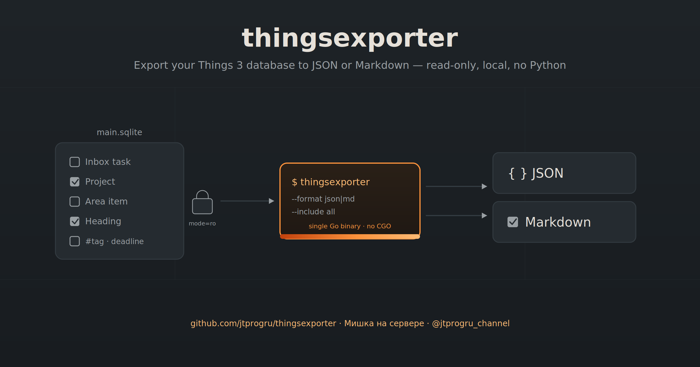

# thingsexporter



A Go CLI utility for exporting the local database of the macOS app [Things 3](https://culturedcode.com/things/) to JSON or Markdown. It reads `main.sqlite` strictly in read-only mode, has no Python dependency, and ships as a single static binary without CGO.

## Installation

### Homebrew (macOS / Linux)

```sh
brew install jtprogru/tap/thingsexporter
```

### `go install`

```sh
go install github.com/jtprogru/thingsexporter/cmd/thingsexporter@latest
```

### From source

```sh
git clone https://github.com/jtprogru/thingsexporter
cd thingsexporter
task build     # → bin/thingsexporter
```

## Usage

### Default — full JSON to stdout

On macOS the database path is detected automatically:

```sh
thingsexporter > things.json
```

On Linux/Windows (or if the database is in a non-standard location):

```sh
thingsexporter --db /path/to/main.sqlite > things.json
```

### Markdown

```sh
thingsexporter --format markdown --out tasks.md
```

The output is a hierarchy `# Inbox` → `# Areas → ## <area> → ### <project>` with GFM checkboxes `[ ]` / `[x]` / `[-]` (canceled), inline `#tag` tags, and deadlines `⏰ YYYY-MM-DD`.

### Subset of data

```sh
# tasks only, without relations
thingsexporter --include tasks

# tasks + tags
thingsexporter --include tasks+tags

# tasks + areas, projects, headings
thingsexporter --include tasks+projects

# table of contents — areas, tags and hierarchy without task bodies
thingsexporter --include structure

# everything (default)
thingsexporter --include all
```

### Useful flags

```
--db <path>          path to main.sqlite (default: auto-discover on macOS)
--out <path|->       output file, '-' = stdout (default: -)
--format json|markdown   output format (default: json)
--include <preset>   contents: all|structure|tasks|tasks+tags|tasks+projects (default: all)
--indent <int>       JSON indentation, 0 = compact (default: 2)
--no-blobs           do not output BLOB fields (by default they are emitted as hex)
--quiet              suppress the summary on stderr
```

### Subcommands

```sh
thingsexporter inspect              # counters and databaseVersion without exporting
thingsexporter version              # version + commit + build date
thingsexporter completion bash      # shell completion for bash/zsh/fish/powershell
```

## Supported database version

As of this release, `databaseVersion = 26` is supported. If you open a database of a different version, the utility prints a warning to stderr but continues the export. Please report new versions in the issues.

## Operation

- The database is always opened strictly in read-only mode (`mode=ro`), so the utility is safe to run while Things 3 is running.
- No data is sent anywhere — all processing is local.
- BLOB fields (`cachedTags`, `experimental`, `recurrenceRule`) are serialized as `{"__blob_hex__": "<hex>"}` by default. Parsing plists/recurrence rules is out of scope for the MVP.
- Trashed tasks are included in the `tasks` collection but excluded from the `hierarchy` (as in the reference Python script).

## License

[MIT](./LICENSE) © Mikhail Savin
